# 📸 Visual E2E Test Screenshots

This directory contains screenshots captured during automated E2E tests.

| Screenshot | Description |
| :--- | :--- |
|  | **debug-mode.png** Application with Debug Mode enabled (showing interaction plane and target). |
|  | **initial-state.png** The initial state of the application after engine load. |
| 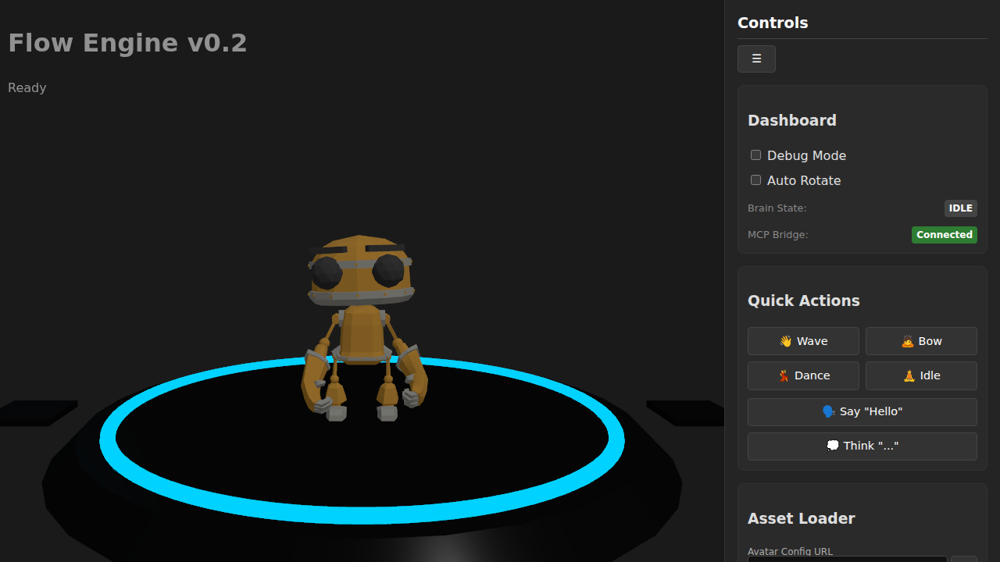 | **mcp-action-bow.png** Avatar performing the "Bow" animation triggered via MCP. |
| 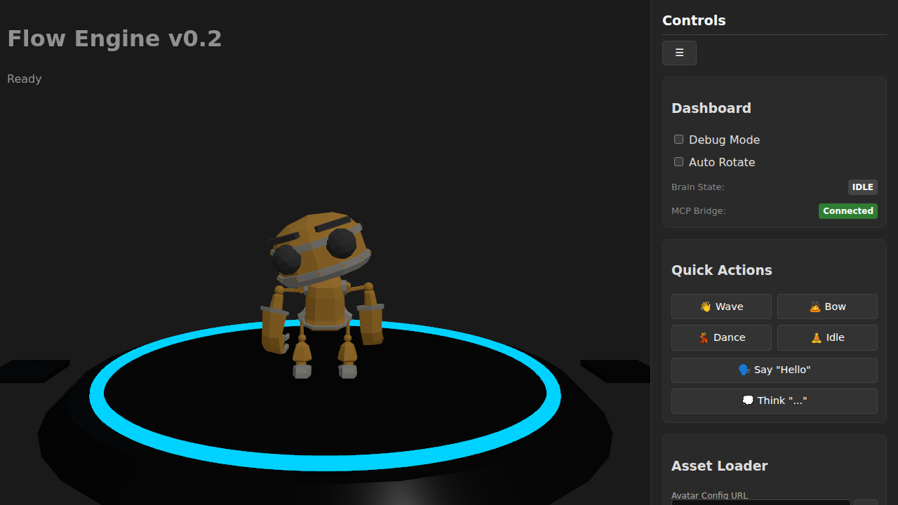 | **mcp-action-dance.png** Avatar performing the "Dance" animation triggered via MCP. |
|  | **mcp-action-death.png** Avatar performing the "Death" animation triggered via MCP. |
| 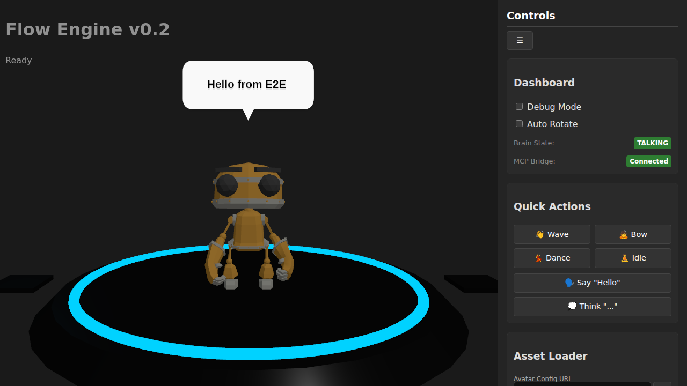 | **mcp-action-say.png** No description available. |
|  | **mcp-action-walk.png** Avatar performing the "Walk" animation triggered via MCP. |
| 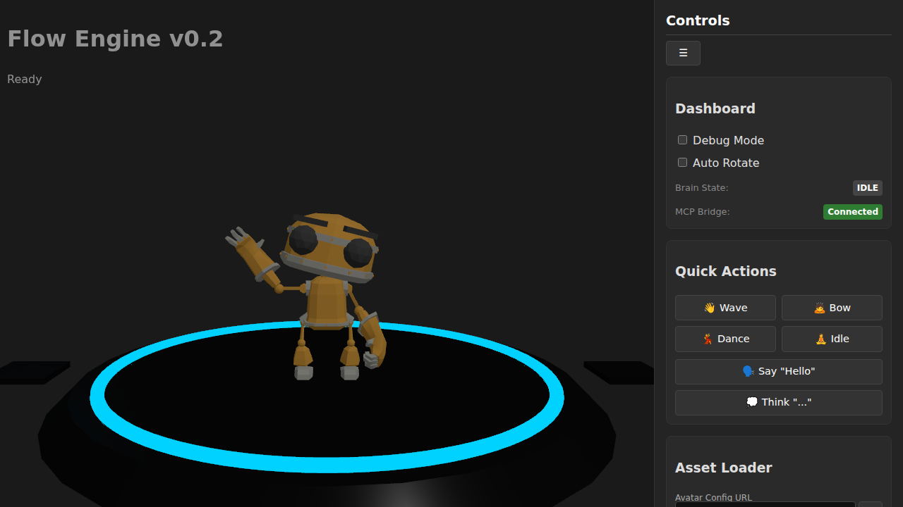 | **mcp-action-wave.png** Avatar performing the "Wave" animation triggered via MCP. |
| 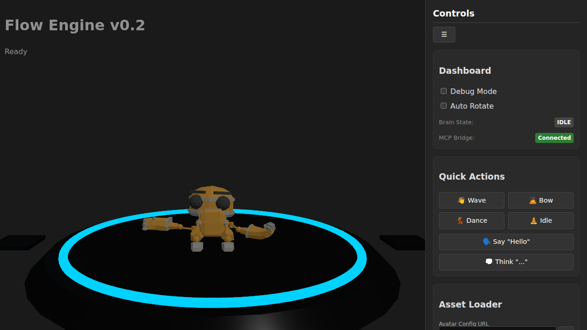 | **mcp-interaction-lookat.png** Avatar looking at a specific target triggered via MCP interaction. |
| 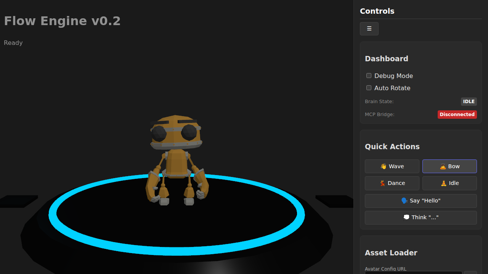 | **ui-action-bow.png** Avatar performing the "Bow" animation triggered via Dashboard UI. |
| 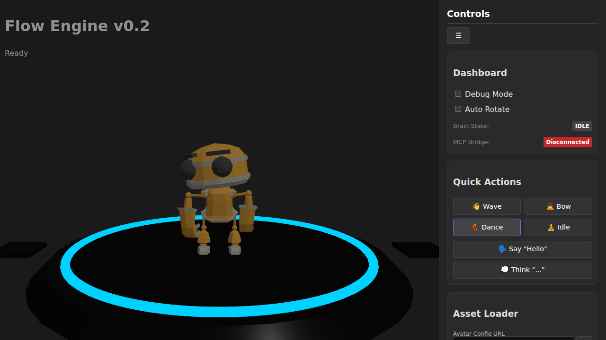 | **ui-action-dance.png** Avatar performing the "Dance" animation triggered via Dashboard UI. |
| 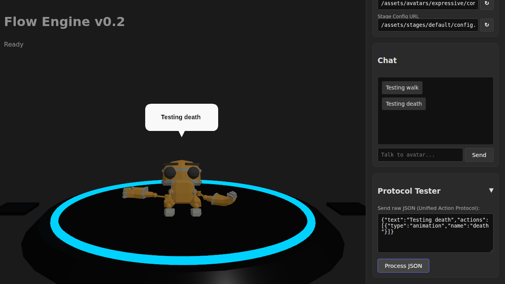 | **ui-action-death.png** Avatar performing the "Death" animation triggered via Protocol Tester. |
| 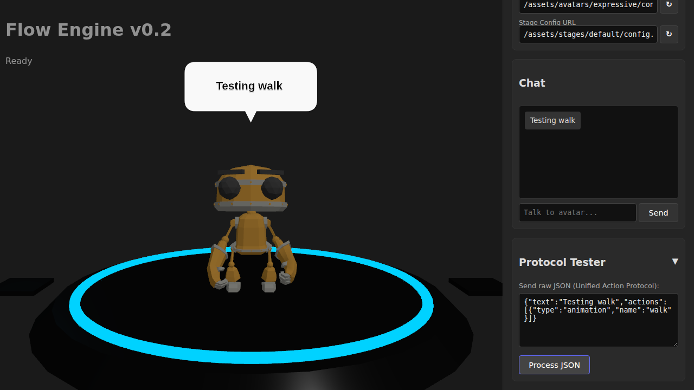 | **ui-action-walk.png** Avatar performing the "Walk" animation triggered via Protocol Tester. |
| 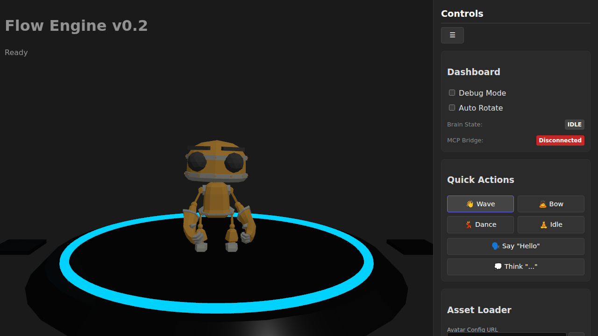 | **ui-action-wave.png** Avatar performing the "Wave" animation triggered via Dashboard UI. |
| 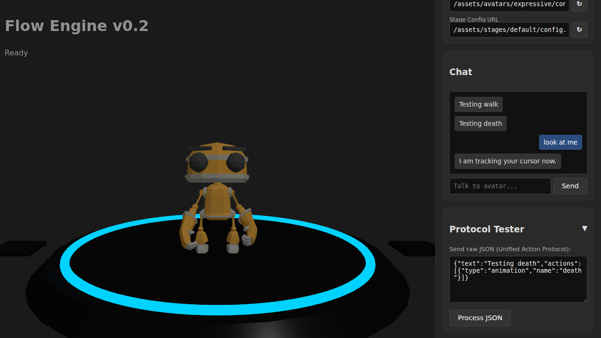 | **ui-state-listening.png** Avatar in LISTENING state, tracking the cursor. |
