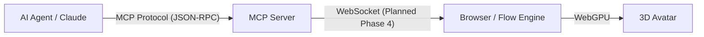
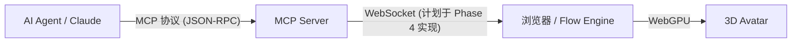

# 🤖 Flow Engine MCP Guide / MCP 集成指南

[English](#english) | [中文](#中文)

---

## English

This guide explains how to use the **Model Context Protocol (MCP)** server included with Flow Engine to control your 3D avatar using AI agents (like Claude Desktop, Gemini, or custom agents).

### 🚀 Quick Start

#### 1. Requirements
*   Node.js v18+
*   A built version of Flow Engine

#### 2. Running the Server
You can run the MCP server directly from the project root:

```bash
# Install dependencies
npm install

# Build the project (required for types and artifacts)
npm run build

# Start the MCP Server
npm run mcp
```

The server runs over `stdio` (Standard Input/Output), which is the standard transport for local MCP connections. It will not output anything visible unless an MCP client connects to it.

---

### 🔌 Connecting to Clients

#### Claude Desktop
To let Claude control your avatar, add the following configuration to your `claude_desktop_config.json`:

**MacOS:** `~/Library/Application Support/Claude/claude_desktop_config.json`
**Windows:** `%APPDATA%\Claude\claude_desktop_config.json`

```json
{
  "mcpServers": {
    "flow-engine": {
      "command": "node",
      "args": ["/ABSOLUTE/PATH/TO/flow-engine/src/mcp/server.ts"],
      "env": {
        "NODE_OPTIONS": "--loader ts-node/esm"
      }
    }
  }
}
```
*Note: For a smoother experience, we recommend pointing to the compiled JS if available, or using `tsx` if running from source.*

**Recommended (using `npm run mcp` wrapper):**
```json
{
  "mcpServers": {
    "flow-engine": {
      "command": "npm",
      "args": ["run", "mcp"],
      "cwd": "/ABSOLUTE/PATH/TO/flow-engine"
    }
  }
}
```

---

### 🛠️ Available Tools

The MCP server exposes the following tools to the AI agent:

#### `say`
Makes the avatar speak with a text bubble and animation.
*   **text** (string, required): The content to speak.
*   **duration** (number, optional): How long to display the bubble (ms). Default: 3000.

#### `think`
Makes the avatar enter a thinking state.
*   **text** (string, optional): The thought bubble content. Default: "...".
*   **duration** (number, optional): Duration of the thinking state (ms). Default: 3000.

#### `play_action`
Triggers a raw animation clip.
*   **action** (string, required): Name of the animation (e.g., "wave", "dance", "bow").

---

### 🏗️ Architecture



**Current Status (v0.2):**
The MCP Server currently logs actions to `stderr` as a placeholder. In **Phase 4**, we will implement the WebSocket bridge to forward these commands to the live browser session.

---

## 中文

本指南介绍了如何使用 Flow Engine 内置的 **Model Context Protocol (MCP)** 服务器，通过 AI Agent（如 Claude Desktop, Gemini 或自定义 Agent）来控制您的 3D 数字人。

### 🚀 快速开始

#### 1. 环境要求
*   Node.js v18+
*   Flow Engine 的构建版本

#### 2. 运行服务器
您可以在项目根目录直接运行 MCP 服务器：

```bash
# 安装依赖
npm install

# 构建项目 (需要生成类型定义和产物)
npm run build

# 启动 MCP 服务器
npm run mcp
```

服务器通过 `stdio` (标准输入/输出) 运行，这是本地 MCP 连接的标准传输方式。除非有 MCP 客户端连接，否则它不会输出任何可见内容。

---

### 🔌 连接客户端

#### Claude Desktop
要让 Claude 控制您的数字人，请将以下配置添加到您的 `claude_desktop_config.json`：

**MacOS:** `~/Library/Application Support/Claude/claude_desktop_config.json`
**Windows:** `%APPDATA%\Claude\claude_desktop_config.json`

**推荐配置 (使用 `npm run mcp` 包装器):**
```json
{
  "mcpServers": {
    "flow-engine": {
      "command": "npm",
      "args": ["run", "mcp"],
      "cwd": "/您的/项目/绝对路径/flow-engine"
    }
  }
}
```

---

### 🛠️ 可用工具 (Tools)

MCP 服务器向 AI Agent 暴露了以下工具：

#### `say` (说话)
让数字人说话，显示气泡并播放说话动画。
*   **text** (string, 必填): 说话内容。
*   **duration** (number, 可选): 气泡显示时长 (毫秒)。默认: 3000。

#### `think` (思考)
让数字人进入思考状态。
*   **text** (string, 可选): 思考气泡的内容。默认: "..."。
*   **duration** (number, 可选): 思考状态时长 (毫秒)。默认: 3000。

#### `play_action` (播放动作)
触发原始动画片段。
*   **action** (string, 必填): 动画名称 (例如: "wave", "dance", "bow")。

---

### 🏗️ 架构设计



**当前状态 (v0.2):**
MCP Server 目前仅将动作日志输出到 `stderr` 作为占位符。在 **Phase 4** 中，我们将实现 WebSocket 桥接，将指令实时转发到浏览器会话中。